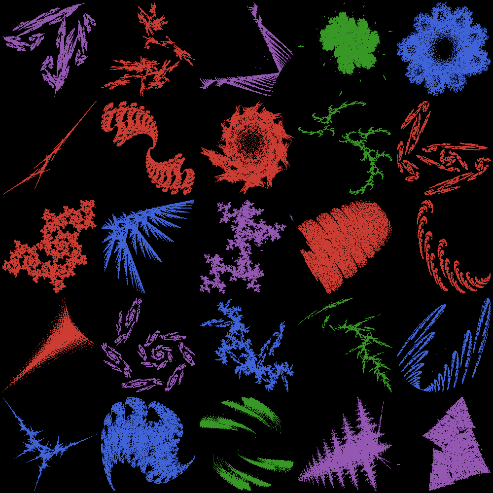

# Rust Random Logo

[](https://github.com/AtelierArith/rust-random-logo/actions)

> **Note**: This project was not created by a human. It was 99% generated by an AI assistant (anthropic:claude-3-7-sonnet-20250219) using the [Cline tool](https://github.com/cline/cline).

A Rust implementation of the [RandomLogos.jl](https://github.com/AtelierArith/RandomLogos.jl) fractal generation library, based on the [Improving Fractal Pre-training](http://catalys1.github.io/fractal-pretraining/) approach. This project serves as an educational resource for learning Rust through a practical implementation of fractal generation algorithms.

## Overview

This library generates fractal-like images using Iterated Function Systems (IFS) with a sigma-factor approach. It is a port of the original [RandomLogos.jl](https://github.com/AtelierArith/RandomLogos.jl) Julia implementation, designed to showcase Rust's features and best practices.

## Features

- Generate beautiful fractal-like images using Iterated Function Systems
- Configure parameters via TOML configuration files
- High-performance implementation leveraging Rust's zero-cost abstractions
- Comprehensive error handling with custom error types
- Well-documented code with examples and tests
- Continuous Integration with GitHub Actions

## Getting Started

### Prerequisites

- Rust (latest stable version recommended)
- Cargo (comes with Rust)

### Installation

Clone the repository and build the project:

```bash
git clone https://github.com/AtelierArith/rust-random-logo.git
cd rust-random-logo
cargo build --release
```

### Running the Examples

Generate a fractal using the provided examples:

```bash
# Basic example - generates a single fractal
cargo run --example basic

# Grid example - generates 25 fractals in a 5x5 grid
cargo run --example grid
```

We will get:



Or use the command-line interface:

```bash
cargo run -- examples/config.toml output.png
```

## Usage

### As a Library

Add this to your `Cargo.toml`:

```toml
[dependencies]
rust-random-logo = "0.1.0"
```

#### Basic Usage

```rust
use rust_random_logo::{Config, render_from_config};
use std::path::PathBuf;

fn main() -> Result<(), Box<dyn std::error::Error>> {
    // Load configuration from a TOML file
    let config = Config::from_file("examples/config.toml")?;

    // Generate the image
    let image = render_from_config(&config)?;

    // Save the image
    let output_path = PathBuf::from("fractal.png");
    image.save(&output_path)?;

    Ok(())
}
```

#### Advanced Usage

For more control over the fractal generation process:

```rust
use rust_random_logo::{Config, SigmaFactorIFS, render, rand_sigma_factor_ifs};
use rand::SeedableRng;
use rand_xoshiro::Xoshiro256PlusPlus;

fn main() -> Result<(), Box<dyn std::error::Error>> {
    // Create a random number generator with a seed
    let mut rng = Xoshiro256PlusPlus::seed_from_u64(99);

    // Create a random IFS
    let ifs = rand_sigma_factor_ifs(&mut rng);

    // Create a configuration
    let config = Config {
        height: 384,
        width: 384,
        npoints: 100_000,
        ifs_name: "SigmaFactorIFS".to_string(),
        ndims: 2,
        rng_name: "Xoshiro256PlusPlus".to_string(),
        seed: 99,
    };

    // Render the image
    let image = render(rng, &ifs, &config);

    // Save the image
    image.save("fractal_advanced.png")?;

    Ok(())
}
```

### Configuration

The library uses TOML configuration files to specify parameters for fractal generation:

```toml
# Image dimensions
height = 384
width = 384

# Number of points to generate
npoints = 100000

# IFS configuration
ifs_name = "SigmaFactorIFS"
ndims = 2

# Random number generator configuration
rng_name = "Xoshiro256PlusPlus"
seed = 99
```

## Continuous Integration

This project uses GitHub Actions for continuous integration. The CI pipeline includes:

- Code formatting check with `rustfmt`
- Linting with `clippy`
- Building the project
- Running tests
- Running examples
- Generating code coverage reports

You can see the CI workflow configuration in `.github/workflows/rust.yml`.

## Learning Rust with This Project

This project demonstrates several Rust concepts and best practices:

1. **Type System**: Using Rust's strong type system with generics and traits
2. **Error Handling**: Proper error propagation with the `?` operator and custom error types
3. **Memory Safety**: Leveraging Rust's ownership system for safe and efficient memory management
4. **Performance Optimization**: Using efficient data structures and algorithms
5. **Testing**: Comprehensive unit and integration tests
6. **Documentation**: Well-documented code with examples
7. **CI/CD**: Continuous integration with GitHub Actions

Key files to study:

- `src/core/types.rs`: Learn about Rust's type system and traits
- `src/core/ifs.rs`: Understand the implementation of the core algorithm
- `src/error.rs`: See how custom error types are implemented
- `src/core/renderer.rs`: Learn about image generation and processing
- `tests/integration_tests.rs`: Understand how to write effective tests
- `.github/workflows/rust.yml`: Learn about CI/CD configuration

## Recent Updates

- **Test**: Added a test to verify that the images generated by the basic example and the main program are identical.
- **Feature**: Added a new grid example that generates 25 different fractal images with different seeds and arranges them in a 5x5 grid.

## Performance

The library is optimized for performance. Here are the latest benchmark results:

- Generating an IFS: ~240 ns (237.38 ns - 243.53 ns)
- Rendering a small image (100x100, 10,000 points): ~344 μs (342.77 μs - 347.09 μs)
- Rendering a medium image (384x384, 100,000 points): ~3.57 ms (3.52 ms - 3.62 ms)

You can reproduce these performance results by running the benchmarks:

```bash
# Run all benchmarks
cargo bench

# Run a specific benchmark
cargo bench -- generate_ifs
cargo bench -- render_small
cargo bench -- render_medium
```

The benchmarks are implemented using the Criterion.rs framework and can be found in the `benches/benchmarks.rs` file. The benchmark results may vary slightly depending on your hardware and system load.

## License

This project is licensed under the MIT License - see the LICENSE file for details.

## Acknowledgments

- Original [RandomLogos.jl](https://github.com/AtelierArith/RandomLogos.jl) implementation
- [Improving Fractal Pre-training](http://catalys1.github.io/fractal-pretraining/) research

## Appendix

このプロジェクトはファイルの分割・ディレクトリ構造の設計などを含め　Cline + `anthropic:claude-3-7-sonnet-20250219` の組み合わせで, 全てAI生成されたものである． `.clinerules` を作成し Plan + Act で生成を行なった．

```
# プロジェクトの概要

あなたはプログラミング言語 Rust に習熟したプログラマーです．このプロジェクトは [Improving Fractal Pre-training](http://catalys1.github.io/fractal-pretraining/) にて提案されている手法に基づいてフラクタルを作成するプロジェクト `./RandomLogos.jl` をプログラミング言語 Rust へ移植することを目的とします．あなたには人間の代わりに作業をすることを期待します．

## ディレクトリ構造

1. `./RandomLogos.jl` プログラミング言語 Julia で記述されています．
1. `./CxxRandomLogo` は `./RandomLogos.jl` を C++ に移植したものです．
1. `./dart-random-logo` は `./RandomLogos.jl` をプログラミング言語 Dart へ移植したものです．

したがって，基準となる実装は `./RandomLogos.jl` であり，Rust へ移植する場合はこの Julia 実装を参考にしてください．Rust によって得られた成果物は Rust をこれから学ぶための教育的な資料として使うことを想定しています．

## 要件

- `rust-random-logo` というディレクトリを作成し，その中に Rust に移植したコードを配置すること
- コードの可読性を重視すること
- Rust のベストプラクティスをふんだんに用いること
- 実行パフォーマンスを重視すること
- コメント・コミットログなどは英語で書くこと
- コードのテストを実装すること
```

上記のファイルの効果は定かではないが，いくつかの修正を（手動ではなくClineを）通して無事 Julia から Rust へ移植することができた．
CI を通すために `cargo clippy`, `cargo fmt` は手動でコマンドを実行した．
なお，Appendix は人間が書いている．
